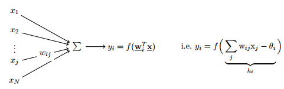
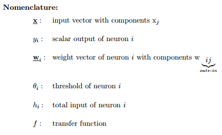
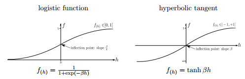
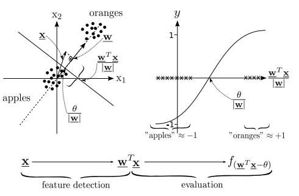

# Machine intelligence 1

Artificial Neural Networks (ANNs)
===============
* simple elements
* massively parallel systems
* low precision (individual elements) & robustness (system)
* distributed representation of information
* __no separation between data and program__

Inductive learning (Learning from observations)
* data driven, adaptive systems
* learning & self-organization vs. deduction & programming
* often seen as a plus: biologically inspired learning rules

## Perceptron (Connectionist Neurons)
### Basics
Connectionist neurons can be modeled as a **linear filter**

  

Where the **input vector** $x$ can be any source of input, from feature sets to images encoded as vectors.  
The **transfer function** $f$ may be logistic or hyperbolic tangent.  

The **threshold** $\theta$ *shifts* the data points $x$ to the left or right.  
To incorporate $\theta$, $x$ can be extended by a constant value (1 is mostly chosen) with weight $w_{i0} = - \theta$  
Since $\theta$ is now part of the weight vector, it will be learned automatically.  
This is also called the **Bias**.

Why does this work? In $h_i$ the $\theta$ is constant. Lets say $x = (x_1, \cdots, x_N)^\top$. Then we write the following:  

$$h_i = \sum_j w_{ij}x_j - \theta_i = \sum_j [w_{ij}x_j] - \theta_i $$

If we now extend $x$ by $x_0 = 1$ and do the same with **w** and initialize a random $-\theta = w_{i0}$ it follows that

$$h_i = \sum_{j=0} w_{ij}x_j = 1\cdot(-\theta) + \sum_{j=1} w_{ij}x_j$$

Which is exactly the same as above.

### Evaluation
Interpretation of the transfer funxtion, data points and weight vector:

The evaluated $y$ value is the binary result value
## Multilayered Perceptron

### Backpropagation

### Gradient Methods

## Generalization

### Bias and Variance

### Regularization
Regularization fdor Neural Networks
### Cross Validation

## Radial Basis Functions

------------------------------
Support Vector Machines
=======================
Bock:

keinen Bock: Arne
## Elements of Statistical Learing Theory

### Bonferroni

### Nor Free Lunch

### Curse of Dimensionality

$a_3$

$a*4$

## Support Vector Machines

### Structural Risk Mimimazation

### Kernel

### Primal Problem

### Dual Problem

### C-SVM

### Regularization for SVM

### Non-Linear Programming
----------------
Probablilistic Methods
==========================

## Uncertainty and Inference
How do we model the/a world?
### First order logic:

rules that can be used for deductive reasoning. But the first oder logic fails in many situations:
* complete set of antecendents and consequences too large
* no complete theory for domains
* incomplete observations
* stochastic enivironments

### Degrees of Belief

* $P(H): H \rightarrow [0,1] $  
* $P(H) = 0$ H is false
* $P(H) = 1$ H is true
* $0<P(H)<1$ quantifies the **degrees of Belief**

$P(H)$ obeys the laws of probability theory, but there is no justification via repeated observations and stochastic outcome.

### Describing the world with Degrees of Belief
#### Random Variables
* *Random variable:* A part of the world whose status is initially unknown
* *Domain of a random variable:* values the variable can take on

**Examples:**
* Boolean variables
  * variable *cavity*; domain: {true, false}  
* Discrete ordinal variables
  * variable *weather*; domain: {Sunny, rainy, cloudy, snow}  
* Continuous variables
  + variable *temperature*; domain: $R_0^+$

#### Atomic events
A descriptio of the modeled worls is a complete set of the random variables. An **Atomic event** is a complete specification of the random variables that describe the world.
+ atomic events are mutually exclusive
+ set of atomic events must be exhaustive

#### Prior
The **prior** is a specification of the knowledge about the world, without any other information.

**Example:**
+ $P(weather = sunny) = 0.3$

#### Conditional probabilities
The **conditional probabilities** specifies the knowledge of the world, given a set of obervations (evidence).

$P(C|t)$: degree of belive in $C$ given *all* we knoe is $t$.

#### Inference using Joint Probabilities

### Conditional Independence

### Bayes Theorem

## Baysian Networks

### Graphs

#### Cliques

#### Seperators

#### Knowledge Graphs

#### Markov Blanked

### Belief Propagation

## Bayes and Neural Networks
