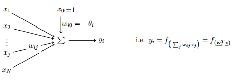
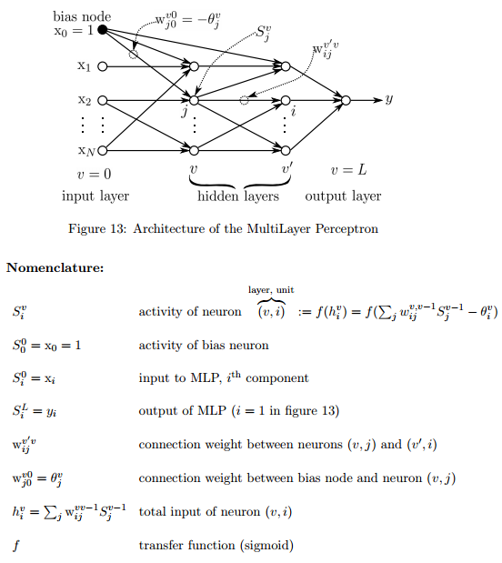
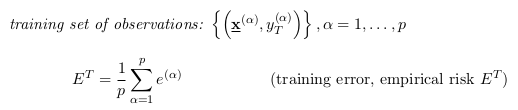
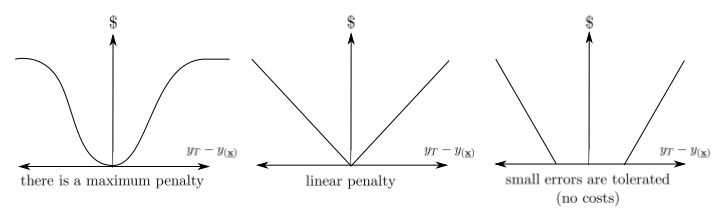
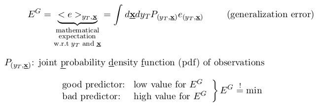
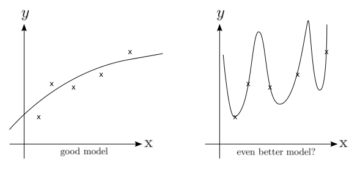

# Machine intelligence 1

Artificial Neural Networks (ANNs)
===============
* simple elements
* massively parallel systems
* low precision (individual elements) & robustness (system)
* distributed representation of information
* __no separation between data and program__

Inductive learning (Learning from observations)
* data driven, adaptive systems
* learning & self-organization vs. deduction & programming
* often seen as a plus: biologically inspired learning rules

## Perceptron (Connectionist Neurons)
### Basics
Connectionist neurons can be modeled as a **linear filter**

  

Where the **input vector** $x$ can be any source of input, from feature sets to images encoded as vectors.  
The **transfer function** $f$ may be logistic or hyperbolic tangent.  

The **threshold** $\theta$ *shifts* the data points $x$ to the left or right.  
To incorporate $\theta$, $x$ can be extended by a constant value (1 is mostly chosen) with weight $w_{i0} = - \theta$  
Since $\theta$ is now part of the weight vector, it will be learned automatically.  
This is also called the **Bias**.

Why does this work? In $h_i$ the $\theta$ is constant. Lets say $x = (x_1, \cdots, x_N)^\top$. Then we write the following:  

$$h_i = \sum_j w_{ij}x_j - \theta_i = \sum_j [w_{ij}x_j] - \theta_i $$

If we now extend $x$ by $x_0 = 1$ and do the same with **w** and initialize a random $-\theta = w_{i0}$ it follows that

$$h_i = \sum_{j=0} w_{ij}x_j = 1\cdot(-\theta) + \sum_{j=1} w_{ij}x_j$$

Which is exactly the same as above. Another intuition can be found [here](http://stackoverflow.com/questions/2480650/role-of-bias-in-neural-networks)

### Evaluation
Interpretation of the transfer function, data points and weight vector:

The evaluated $y$ value is the binary result value
## Multilayered Perceptron
* Recurrent Networks
  * A graph of perceptrons that contain cycles
  * can model dynamic systems, sequence processing
* Feedforward Networks
  * A graph with single start and end node that does not contain any cycles
  * association between variables an prediction of attributes (regression, classification).

**MLPs are universal function approximators**: Even with simple nonlinear functions, MLPs provide a model class with powerful computational capabilities

#### Error functions

For learning, the results of classification or regression need to be evaluated.

**Model selection**: Find model (parameters) such that: $E^T = \min$. **(Empirical risk minimization (ERM))**

Example error functions:

Most commonly used function is the quadratic error function $e_{(y_T,x)} = \frac{1}{2}(y_T - y_{(x)})^2$ with $y_T$ being the **true value** of the attribute and $y_{(x)}$ being the **predicted value** of the attribute.

The problem with $E^T$ is, that we only calculate the error among the data points we know. How can we know that the Error on previously unknown points is also low ? (**generalization error**)

Problem:
* $P_{(y_T,x)}$ is normally unknown
* If it was known, we could evaluate all data points using it directly and would have no need to learn anything. Is is our goal here to come as close to $P$ as possible.
* To find $E^G$, cross-validation can be used. Using this method, we simulate portions of $P$ in every run.
* Hence, *Mathematical analysis*: When does "$E^T = \min$" imply "$E^G$ is small
(enough)"? $\to$ statistical learning theory, ch. 2 of the script.

Think of the classical problem of over and underfitting.

* left: average $E^T$, probably low $E^G$ $\to$ good predictor
* right: small $E^T$, probably high $E^G$ $\to$ bad predictor

### Backpropagation

### Gradient Methods

## Generalization

### Bias and Variance

### Regularization
Regularization fdor Neural Networks
### Cross Validation

## Radial Basis Functions

------------------------------
Support Vector Machines
=======================
Bock:

keinen Bock: Arne
## Elements of Statistical Learing Theory

### Bonferroni

### Nor Free Lunch

### Curse of Dimensionality

$a_3$

$a*4$

## Support Vector Machines

### Structural Risk Mimimazation

### Kernel

### Primal Problem

### Dual Problem

### C-SVM

### Regularization for SVM

### Non-Linear Programming
----------------
Probablilistic Methods
==========================
Bock: Arne

keinen Bock:

## Uncertainty and Inference

## Bayes

### Graphs

#### Cliques

#### Seperators

#### Knowledge Graphs

#### Markov Blanked

### Belief Propagation

## Bayes and Neural Networks
